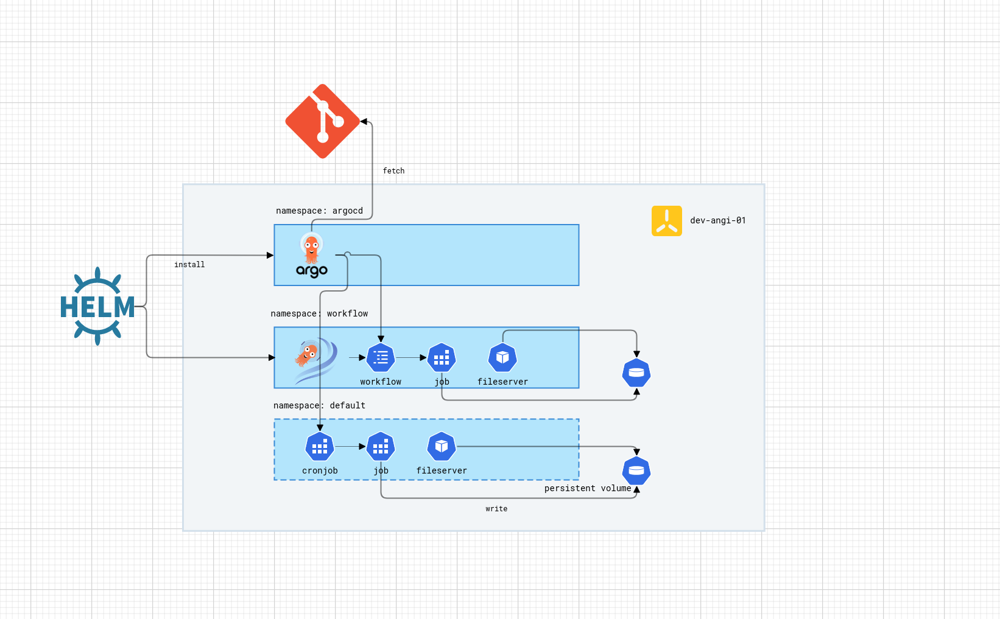

This repo contains my solution for Angi's Data Platform engineer home take test. The exercise is to create a data pipeline that runs on Kubernetes. I have used Python to extract weather forecast from [National Weather Service's](https://www.weather.gov/) publicly accessible API. The script uses geographical coordinates (latitude and longitude) to download an hourly forecast for the location. It reads the configuration from a `config.ini` file.

For running the script/data pipeline on regular interval, I have two solutions. Both solution utilize ArgoCD to reconcile the desired state we have in this git repository with the cluster state. The first approach/solution uses Kubernetes [cronjob](https://kubernetes.io/docs/concepts/workloads/controllers/cron-jobs/) to schedule a job using the cron time format. This solution is good when the data pipeline is a simple and consists of a single task. It is not ideal for complex ETL jobs.

My second solution uses [Argo Workflow's](https://argoproj.github.io/workflows/) cron workflow to define the data pipeline and run it on a schedule. It allows us to model complex pipeline. 

**Note:** For the current iteration of my solution; Terraform for specifying the infrastructure and GitHub Actions for building container images and pushing to a registry are out of scope. My solution is designed to run on-premises Kubernetes cluster.

## Data Pipeline

Data pipeline refer to this [README.md](./app/README.md)

## Kubernetes setup

For this project, I have a single node cluster running **K3s** and Kubernetes version `1.29`. K3s is considered a "batteries included distribution" as it comes prepackaged with an ingress controller, storage prevision and more right out of the box. I have opted to use [Cilium](https://cilium.io/) for [layer 2 announcements](https://docs.cilium.io/en/latest/network/l2-announcements/). This allows service running inside the cluster to be accessed externally, without out a traditional loadbalancer in-front of the cluster. Cilium will be responsible for assigning IP addresses for service with type loadbalancer (IPAM) and responding to ARP requests.

K3s comes installed with a [storage provisioner](https://github.com/rancher/local-path-provisioner), which is able to dynamically create persistent volumes.

## TODO
 - [x] write Ansible playbook to install K3s and required binaries
 - [ ] write Terraform module to create ec2 instances to run this project